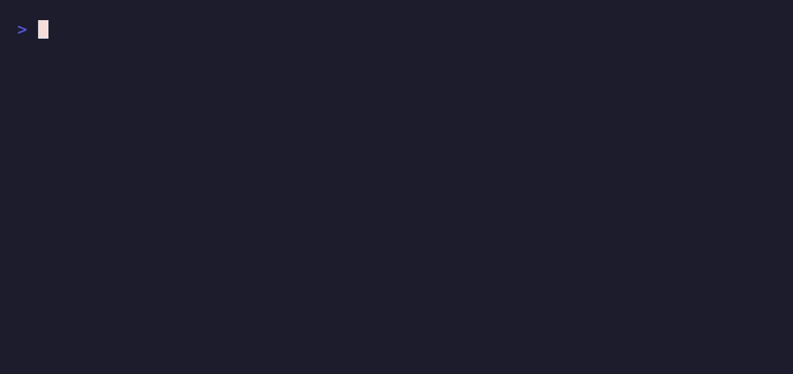
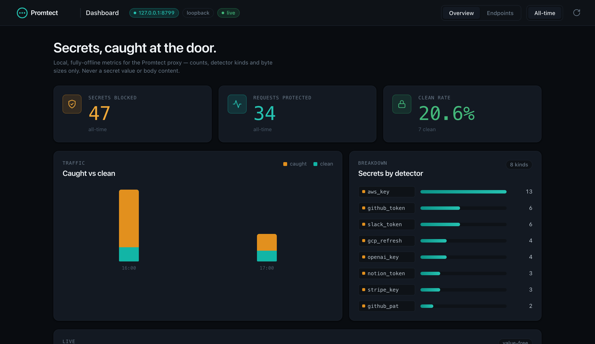

# Promtect

[](LICENSE)
[](https://www.rust-lang.org)

### Keep recognized secrets out of supported AI-tool requests.

**One file with a key in it, handed to an AI tool, is a key you no longer control. You
can rotate it. You can't un-send it.**

Promtect is a local proxy that masks recognized known-format secrets in supported
request bodies before your AI tool sends the remaining prompt upstream. Each match
is replaced on the way out, then restored in the reply when the sentinel is
unchanged (or kept masked in strict mode, your call).

**Source-available under the Sustainable Use License. The proxy runs on your
machine, installs no root certificate, and contains no Promtect telemetry or
hosted control-plane dependency. Its audit format is designed to remain
value-free.**



<sub>Recorded with [`vhs`](https://github.com/charmbracelet/vhs) from [`docs/demo.tape`](docs/demo.tape), rebuild with `cargo build --release && vhs docs/demo.tape`.</sub>

```sh
brew install Amitk3293/tap/promtect
promtect --version
promtect selftest
```

From source: `cargo install --path .` (from a clone of this repo).

```sh
promtect guard ollama run qwen2.5:0.5b         # runtime-proven local guard path
echo "ship it with $AWS_KEY" | promtect mask   # or just see what would get masked
```

Releases are attested GitHub Releases with SHA-256 sidecars for all 4 targets: https://github.com/Amitk3293/promtect/releases

---

## Why

You pasted a `.env` into Claude to debug it. You asked Cursor to "fix the S3
upload", and the file had your access key in it. You let an agent read your
config.

That key is now in a request log on a server you don't own, in a country you
didn't choose, under a retention policy you never read.

**Once a key reaches an AI provider, the advice is the same: rotate it, and treat
anything you sent as compromised.** The tools most developers already use have leaked:

- Shared **ChatGPT** conversations, some with proprietary code,
  [showed up in Google Search](https://www.malwarebytes.com/blog/news/2025/08/openai-kills-short-lived-experiment-where-chatgpt-chats-could-be-found-on-google)
  in 2025; OpenAI pulled the feature and called it a "short-lived experiment."
- **GitHub Copilot** was shown to
  [emit real secrets from its training data](https://blog.gitguardian.com/yes-github-copilot-can-leak-secrets/),
  and once a key is baked in, scrubbing it from your repo no longer removes it.
- **Samsung** engineers pasted source code and secrets into ChatGPT; Samsung banned it
  company-wide.

**For recognized matches on a supported path, Promtect replaces the value before
the configured upstream receives the request.**

**What one slip costs you:** rotate every key in that file, force a redeploy, and write
the note explaining why production credentials went to a third party, and the secret is
already sitting in a log you'll never reach. **What it costs with Promtect:** nothing.
route a supported tool through Promtect, and a recognized key on a verified supported path is
masked before forwarding. Unsupported formats and bypassing clients remain your
responsibility; review the [threat model](THREAT-MODEL.md).

**Switched to a cheap Chinese model to save on tokens?** DeepSeek, Kimi (Moonshot), and
GLM (Zhipu) [now lead coding traffic on OpenRouter](https://www.techtimes.com/articles/317352/20260529/chinese-ai-models-lead-openrouter-traffic-coding-gains-come-china-data-risk.htm),
and every request runs under Chinese jurisdiction, where the National Intelligence Law can
compel access no matter where the server sits. DeepSeek already trained on user input and
[left a database of prompts and API keys exposed](https://www.wiz.io/blog/wiz-research-uncovers-exposed-deepseek-database-leak).
Promtect masks before any of them see it, and `PROMTECT_BLOCK_RISKY=true` refuses them
outright.

---

## How it works

```
Your AI tool ──http──▶ Promtect :8790 ──https──▶ api.anthropic.com
                        │ detect + mask               │
                        └────────── restore ◀─────────┘
```

1. Your tool sends a plaintext HTTP request to Promtect on loopback.
2. Promtect scans the body and replaces each detected secret with an opaque
   sentinel (`«promtect:aws_key:0001»`).
3. Promtect re-originates the request as HTTPS to the upstream API.
4. As the response **streams back**, every sentinel is swapped for the real
   value before your tool reads it, token by token, no buffering, no hang.

No TLS interception. No root certificate. The auth header (`x-api-key`,
`Authorization`) is forwarded verbatim, only the body is ever touched.

---

## A local dashboard, value-free

The dashboard starts automatically on `http://127.0.0.1:8799` whenever the proxy
starts. It serves an offline view of what Promtect has caught: secrets masked,
the per-detector breakdown (counted from audit events), the clean rate, recent
requests, and bytes processed. It reads only the value-free audit schema, which
contains counts and detector names rather than request or response bodies.

Pass `--no-dashboard` to start the proxy without it, or run `promtect dashboard`
standalone to tail an existing audit log without starting a proxy.

Audit aggregation is bounded and runs off the async request path. If the local
dashboard is already at its aggregation limit or a scan fails, `/api/metrics`
and `/metrics` return `503` explicitly instead of showing a false all-clear.

The same counts are exposed for Prometheus at `/metrics`, including
`promtect_output_secrets_total` for anything the Pro output scan caught in a
model's reply. And `promtect guard` prints a one-line session summary when your
tool exits — how many secrets it masked this session and by which detectors — so
you get the signal without it cluttering the tool while you work.



## Design difference

Transparent mode can restore an unchanged sentinel for usable answers, while
strict mode leaves it masked. Promtect does this as an application-level proxy
and does not install a root certificate or change the system trust store.

---

## Run it in one command

`promtect guard <tool>` starts the proxy, points your tool at it, runs the tool,
and tears it down on exit, no manual env-var wiring:

```sh
promtect guard ollama run qwen2.5:0.5b    # runtime-proven local Ollama path
promtect guard claude                     # beta; requires supported direct Anthropic auth/routing
promtect guard codex                      # beta; unsupported auth/routing fails before a prompt
promtect guard ollama --cloud run gpt-oss:120b-cloud   # Ollama Cloud → masked → ollama.com
promtect guard aider --model openai/gpt-5.5  # Aider → masked → OpenAI-compatible
promtect guard claude --headroom          # chain Headroom: mask → compress → Anthropic
promtect guard codex --strict             # never re-insert secrets in the response
promtect guard --exec <tool> --base-var OPENAI_API_BASE --base-path /v1   # wrap any tool
```

`guard codex` supports OpenAI API-key sessions. It fails before opening a
provider connection for ChatGPT subscription auth, OpenRouter, custom provider
routing, or request-compression overrides because those modes cannot currently
guarantee interception. Supported model-calling roots are the interactive CLI,
`exec`/`e`, and `review`; use `exec <prompt>` for single-token prompts so they
cannot be mistaken for a new root command. Unknown root commands fail closed.
It also disables Codex WebSockets and provider retries, keeping each protected
model call on one observable HTTP Responses request.

`guard claude` currently supports a verified first-party, unmanaged individual
Claude Max profile. It fails before binding for API-key, Pro, Team, Enterprise,
gateway, remote/endpoint-managed, or unknown profiles because Claude managed
settings outrank command-line routing and hooks. API-key users can use the
[manual Claude proxy setup](docs/integrations/claude-code.md#start-promtect-manual),
which does not include the automatic in-session notice.

Manual proxy sessions and supported non-Claude guards forward their provider API
keys untouched; Promtect only masks the request body. `guard claude` instead
refuses environment auth overrides and uses the verified stored individual Max
credential. The base URL each tool needs is set for you (`ANTHROPIC_BASE_URL` for
Claude, `OPENAI_BASE_URL` for Codex, `OLLAMA_HOST` for Ollama). Local Ollama runs on
your own machine, so there is little to protect; `--cloud` points it at `ollama.com`,
where your prompt leaves the box and masking earns its keep. Combine with
[Headroom](https://github.com/chopratejas/headroom) for secrets-safe **and** ~90%
cheaper sessions.

---

## Quickstart (manual)

### Native

```sh
cargo run            # binds 127.0.0.1:8790, upstream → api.anthropic.com
# in another shell:
ANTHROPIC_BASE_URL=http://127.0.0.1:8790 claude
```

### Docker

```sh
docker compose up --build
ANTHROPIC_BASE_URL=http://127.0.0.1:8790 claude
```

> **Security:** publish the port to `127.0.0.1:8790:8790`, never `8787:8787`.
> The bundled `docker-compose.yml` does this correctly by default.

### Prove it works (no network needed)

```sh
promtect selftest    # masks and restores a synthetic detector canary locally
```

---

## Works with your whole stack

Promtect protects more than Claude Code. Pick a provider with `PROMTECT_MODE`, or
point `PROMTECT_UPSTREAM` at anything (the **chaining knob**).

| Tool | Setup |
|------|-------|
| **Claude Code** | `promtect guard claude` for reviewed Claude Code 2.1.209 + individual Max + automatic notice; manual base-URL routing remains available for API-key use ([guide](docs/integrations/claude-code.md)) |
| **Cursor** | `PROMTECT_MODE=openai promtect`; set Cursor's OpenAI base URL to `http://127.0.0.1:8790/v1` |
| **OpenAI Codex CLI** | `PROMTECT_MODE=openai promtect`; `OPENAI_BASE_URL=http://127.0.0.1:8790/v1` |
| **Ollama** (local/Chinese models) | `PROMTECT_MODE=ollama promtect`; `OPENAI_BASE_URL=http://127.0.0.1:8790/v1` |
| **OpenRouter** | `PROMTECT_MODE=openrouter promtect`; `OPENAI_BASE_URL=http://127.0.0.1:8790/api/v1` |
| **Agent harnesses** (OpenCode, Crush, Goose, Pi) | set the harness's provider `baseUrl` to `http://127.0.0.1:8790` ([guide](docs/integrations/harnesses.md)) |
| **Aider** | `promtect guard aider --model openai/gpt-5.5` |
| **OpenClaw / NanoClaw** | point the gateway's provider base URL (or `ANTHROPIC_BASE_URL`) at Promtect ([OpenClaw](docs/integrations/openclaw.md), [NanoClaw](docs/integrations/nanoclaw.md)) |
| **Headroom / LiteLLM / corp proxy** | `PROMTECT_UPSTREAM=<their-url> promtect` (Promtect goes first) |
| **VS Code Copilot** | not yet, it needs a root CA, which Promtect deliberately avoids ([why](docs/integrations/vscode-copilot.md)) |

Full guides: [`docs/integrations/`](docs/integrations/README.md). It doesn't
matter whether you're using Claude, GPT, DeepSeek, or a local model, Promtect
masks recognized matches when the client is verified to route through it.

### Environment variables

| Variable | Default | Description |
|---|---|---|
| `PROMTECT_PORT` | `8790` | Local port to bind (loopback) |
| `PROMTECT_MODE` | `anthropic` | Upstream preset: `anthropic` / `openai` / `ollama` / `openrouter` |
| `PROMTECT_UPSTREAM` |, | Explicit upstream URL; overrides mode (chaining) |
| `PROMTECT_RESTORE` | `true` | `false` = strict mode: secrets are never re-inserted |
| `PROMTECT_BLOCK_RISKY` | `false` | `true` = refuse to proxy to a high-risk/unverified upstream (e.g. DeepSeek) |
| `PROMTECT_AUDIT` | `promtect-audit.jsonl` | Value-free audit log path |
| `PROMTECT_BIND` | `127.0.0.1` | Bind address (loopback by default) |
| `PROMTECT_MAX_BODY_BYTES` | `33554432` | Request-body cap (32 MiB) before a 413 |
| `PROMTECT_DASHBOARD_PORT` | `8799` | Dashboard port (`promtect dashboard`) |

---

## Two modes, you choose

- **Transparent (default):** secret masked outbound, real value restored
  in the answer → AI output is directly usable.
- **Strict (`PROMTECT_RESTORE=false`):** a detected value is masked outbound and
  Promtect does not restore it from the per-request vault into the response.

---

## What it detects

Promtect ships detectors covering known credential formats across a wide range
of providers:

- **AI/LLM:** Anthropic, OpenAI, Groq, OpenRouter, Replicate, Perplexity,
  Fireworks, NVIDIA, HuggingFace, Google AI, xAI
- **Cloud/infra:** AWS (keys + secret), GCP, Azure Storage, DigitalOcean,
  Doppler, HashiCorp Vault, Terraform, Databricks, PlanetScale, Tailscale,
  Supabase, Render, Fly.io
- **Dev tools:** GitHub, GitLab, npm, PyPI, Docker Hub, Shopify, Linear,
  Atlassian, Figma, Notion, Airtable, RubyGems, Postman, SonarQube, CircleCI
- **SaaS/pay:** Slack, Discord, Twilio, SendGrid, Mailgun, Stripe, Square,
  Razorpay
- **AI infra:** Pinecone, LangSmith, MCP-style bearer tokens
- **Structural:** JWTs, PEM / OpenSSH / PGP private keys, DB-URL passwords,
  `.env`-style `KEY=value` pairs (with a placeholder + code-expression guard)

Adding a detector is ~one line in `src/detect.rs`, see
[CONTRIBUTING.md](CONTRIBUTING.md).

The test suite asserts every detector masks a synthetic secret and that prose, code
expressions, and placeholders are **never** masked, the benchmark in
[`tests/corpus.rs`](tests/corpus.rs) catches 20/20 representative formats with 0 false
positives on the negative corpus.

---

## What it catches, and what it doesn't (yet)

Promtect is a focused control, not a catch-everything. It's honest about its edges:

| Catches | Doesn't catch (yet) |
|---|---|
| Known-format secrets in the request body (keys, tokens, DB-URL passwords, JWTs, PEM keys) | Unknown-format / high-entropy secrets with no recognizable shape |
| UTF-8 text bodies of tools with a base-URL override (Claude Code, Cursor, Codex, Ollama, OpenRouter) | The model's **response** (restore only re-inserts what it masked) |
| The streamed response (real-time restore, or sentinels retained in strict mode) | Encoded secret values Promtect has not decoded (base64, percent-encoding, protobuf, multipart parts) |
| | Tools without a base-URL override (VS Code Copilot, browser chat) |

Promtect scans the complete raw request body only when it is valid UTF-8. A
text-only multipart body is scanned as flat text, not parsed as multipart; a body
containing non-UTF-8 bytes is forwarded unchanged and unscanned. Request headers,
including `Authorization` and `x-api-key`, are forwarded and never scanned.
Non-identity `Content-Encoding` is rejected with HTTP 415 before DNS resolution or
an upstream connection. Decompress the body before sending it through Promtect.

Request scanning has bounded admission (`min(available CPU threads, 4)`, with at
least one slot). When every slot is occupied, Promtect returns a value-free HTTP
503 before retaining the body or connecting upstream; retry the request after
capacity becomes available. An admitted request must deliver its complete body
within 30 seconds. Otherwise Promtect returns a value-free HTTP 408, releases the
slot, and never connects upstream. These rejections are recorded as
`request_rejected` audit events with kinds `scan_capacity` and `body_timeout` and
fixed non-secret markers.

Full scope and trust assumptions: **[THREAT-MODEL.md](THREAT-MODEL.md)**.

## Know where you're sending

Masking is half the story, *where* the request goes still matters. Promtect classifies
the upstream and prints a one-line risk note at startup:

```
upstream risk: Anthropic API: an exposed key still means rotate it; Promtect keeps
               it from arriving.
upstream risk: DeepSeek: HIGH RISK: trains on your input, China jurisdiction
               (National Intelligence Law can compel access), no zero-retention.
upstream risk: Kimi (Moonshot AI): HIGH RISK: data processed in China; the National
               Intelligence Law can compel access regardless of server.
```

Set `PROMTECT_BLOCK_RISKY=true` to refuse high-risk or unverified upstreams (DeepSeek,
Kimi, GLM, or any host Promtect can't vouch for) outright. Fail-closed.

---

## Trust model

- **Memory-only.** Secrets exist only in RAM and are zeroized on drop via the
  `zeroize` crate.
- **Per-request vault.** Each request gets a fresh vault; a sentinel minted for
  request A cannot restore a secret from request B, cross-request bleed is
  impossible by construction.
- **Round-trip proven.** `restore(mask(x)) == x` is a property test, and the
  streaming restorer is proven byte-for-byte identical to whole-buffer restore at
  every chunk boundary.
- **Headers untouched.** Auth headers are forwarded verbatim; Promtect scans
  request bodies only.
- **No telemetry.** Exactly one outbound connection per proxied request.

---

## Dashboard & audit

```sh
promtect --no-dashboard # start proxy only, skip the metrics dashboard
promtect dashboard      # standalone dashboard (no proxy) — UI, /api/metrics, /metrics (Prometheus)
```

Every mask/unmask event is appended to `promtect-audit.jsonl`: timestamp,
action, detector kind, sentinel ID, and request ID. The schema has no request,
response, or detected-value field.

---

## Develop

```sh
make test     # cargo test, 126 unit + integration + property tests
make lint     # cargo fmt --check + clippy --all-targets -D warnings
make smoke    # build + run: prove masking + value-free audit
```

See [TESTING.md](TESTING.md), [CONTRIBUTING.md](CONTRIBUTING.md), and
[SECURITY.md](SECURITY.md).

---

## Documentation

- **[Try it (FAQ & troubleshooting)](docs/faq.md)** — prove it's masking, multi-tool setup, strict mode, common gotchas.
- **[Detector reference](docs/detectors.md)** — every detector, by provider, with the current count.
- **[Architecture](docs/architecture.md)** — how a request flows through detect → vault → mask → streaming restore.
- **[Integrations](docs/integrations/README.md)** — Claude Code, Cursor, Codex, Ollama, OpenRouter, chaining.
- **[Pro overview](docs/pro.md)** — what the paid layer adds and how it composes with the core.
- **[Pricing & editions](COMMERCIAL.md)** — Free, Pro, Team, Enterprise.
- **[Threat model](THREAT-MODEL.md)** · **[Roadmap](ROADMAP.md)** · **[Security policy](SECURITY.md)**

Full index: **[docs/](docs/README.md)**.

Or run it locally with no setup: `promtect playground` narrates a full
mask → forward → restore round-trip against a mock upstream.

---

## License

Promtect is **open-core**.

The core in this repo (the proxy and all its known-secret detectors) is licensed under
the **Sustainable Use License**, a fair-code, source-available license. It is free for
internal business, personal, and non-commercial use. You can read, run, modify, and
self-host it. You cannot resell it or run it as a paid service for others. Full terms
in [LICENSE](LICENSE).

Pro is the beta paid layer for entropy, PII/PHI/payment, Skills/MCP static scan,
and response scan components. It is not available for purchase until artifact,
activation, fulfillment, and recovery gates pass. See
[COMMERCIAL.md](COMMERCIAL.md).

"Promtect" is a trademark of AK DevOps Solutions SL. See [TRADEMARK.md](TRADEMARK.md).

Source-available and fair-code, not OSI "open source". Copyright 2026 AK DevOps
Solutions SL.
